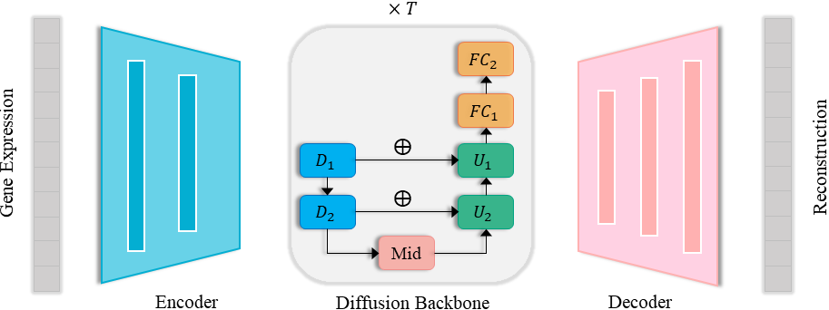

# cfDiffusion:Diffusion-based efficient generation of high quality scRNA-seq data with classifier-free guidance




# Environment
```
accelerate                0.29.2
anndata                   0.9.2
anyio                     4.0.0
argon2-cffi               23.1.0
argon2-cffi-bindings      21.2.0
arrow                     1.2.3
asttokens                 2.4.0
async-lru                 2.0.4
attrs                     23.1.0
Babel                     2.12.1
backcall                  0.2.0
beautifulsoup4            4.12.2
bleach                    6.0.0
blobfile                  2.1.1
cairocffi                 1.7.1
CairoSVG                  2.7.1
celltypist                1.6.2
certifi                   2023.7.22
cffi                      1.15.1
charset-normalizer        3.2.0
click                     8.1.7
comm                      0.1.4
contourpy                 1.1.0
cssselect2                0.7.0
cycler                    0.11.0
Cython                    3.0.7
d2l                       1.0.3
debugpy                   1.7.0
decorator                 5.1.1
defusedxml                0.7.1
Deprecated                1.2.14
diffusers                 0.27.2
dill                      0.3.8
einops                    0.7.0
et-xmlfile                1.1.0
exceptiongroup            1.1.3
executing                 1.2.0
fastjsonschema            2.18.0
filelock                  3.13.1
fonttools                 4.42.1
fqdn                      1.5.1
fsspec                    2024.2.0
gensim                    4.3.2
get-annotations           0.1.2
gitdb                     4.0.11
GitPython                 3.1.40
h5py                      3.10.0
huggingface-hub           0.21.4
idna                      3.4
igraph                    0.11.4
imageio                   2.34.0
imbalanced-learn          0.12.0
importlib-metadata        6.8.0
importlib-resources       6.0.1
ipykernel                 6.25.2
ipython                   8.12.2
ipython-genutils          0.2.0
ipywidgets                8.1.0
isoduration               20.11.0
jedi                      0.19.0
jieba                     0.42.1
Jinja2                    3.1.2
joblib                    1.3.2
json5                     0.9.14
jsonpointer               2.4
jsonschema                4.19.0
jsonschema-specifications 2023.7.1
jupyter                   1.0.0
jupyter_client            8.3.1
jupyter-console           6.6.3
jupyter_core              5.3.1
jupyter-events            0.7.0
jupyter-lsp               2.2.0
jupyter_server            2.7.3
jupyter_server_terminals  0.4.4
jupyterlab                4.0.5
jupyterlab-pygments       0.2.2
jupyterlab_server         2.24.0
jupyterlab-widgets        3.0.8
kiwisolver                1.4.5
labml                     0.4.168
labml-helpers             0.4.89
leidenalg                 0.10.2
llvmlite                  0.41.1
lmdb                      1.4.1
lxml                      4.9.4
MarkupSafe                2.1.3
matplotlib                3.7.2
matplotlib-inline         0.1.6
mistune                   3.0.1
mpi4py                    3.1.4
natsort                   8.4.0
nbclient                  0.8.0
nbconvert                 7.8.0
nbformat                  5.9.2
nest-asyncio              1.5.7
networkx                  3.1
notebook                  7.0.3
notebook_shim             0.2.3
numba                     0.58.1
numpy                     1.23.5
openpyxl                  3.1.2
overrides                 7.4.0
packaging                 23.1
pandas                    2.0.3
pandocfilters             1.5.0
parso                     0.8.3
patsy                     0.5.6
pexpect                   4.8.0
pickleshare               0.7.5
Pillow                    10.0.0
pip                       23.2.1
pkgutil_resolve_name      1.3.10
pkuseg                    0.0.25
platformdirs              3.10.0
prometheus-client         0.17.1
prompt-toolkit            3.0.39
psutil                    5.9.5
ptyprocess                0.7.0
pure-eval                 0.2.2
pycparser                 2.21
pycryptodomex             3.20.0
pydot                     2.0.0
Pygments                  2.16.1
pynndescent               0.5.11
pyparsing                 3.0.9
python-dateutil           2.8.2
python-json-logger        2.0.7
pytorch-fid               0.3.0
pytz                      2023.3.post1
PyYAML                    6.0.1
pyzmq                     25.1.1
qtconsole                 5.4.4
QtPy                      2.4.0
referencing               0.30.2
regex                     2023.12.25
requests                  2.31.0
rfc3339-validator         0.1.4
rfc3986-validator         0.1.1
rpds-py                   0.10.2
safetensors               0.4.2
scanpy                    1.9.8
scib                      1.1.5
scikit-learn              1.3.2
scikit-misc               0.2.0
scipy                     1.10.1
seaborn                   0.13.2
Send2Trash                1.8.2
session-info              1.0.0
setuptools                68.0.0
six                       1.16.0
smart-open                6.4.0
smmap                     5.0.1
sniffio                   1.3.0
soupsieve                 2.5
stack-data                0.6.2
statannotations           0.4.4
statsmodels               0.14.1
stdlib-list               0.10.0
terminado                 0.17.1
texttable                 1.7.0
threadpoolctl             3.2.0
timm                      0.9.16
tinycss2                  1.2.1
tokenizers                0.15.2
tomli                     2.0.1
torch                     1.10.1+cu111
torchvision               0.11.2+cu111
tornado                   6.3.3
tqdm                      4.66.1
traitlets                 5.9.0
transformers              4.39.3
typing_extensions         4.7.1
tzdata                    2023.3
umap-learn                0.5.5
uri-template              1.3.0
urllib3                   2.0.4
wcwidth                   0.2.6
webcolors                 1.13
webencodings              0.5.1
websocket-client          1.6.2
wheel                     0.38.4
widgetsnbextension        4.0.8
wrapt                     1.16.0
zipp                      3.16.2
```

# Train the cfDiffusion model

**Dataset:**
The data used for training the model is formatted in `h5ad`.  For other formats, modify the code in `./guided_diffusion/cell_datasets_*.py.` All the datasets used in the paper are placed in the dataset folder.

You can directly run the following command to complete all the training steps. Be aware to change the file path to your own.

```sh
### Mizrak
CUDA_VISIBLE_DEVICES=1 python VAE_train.py --data_dir '/home/workplace/cfDiffusion/dataset/Mizrak_filtered.h5ad' --num_genes 26791 --save_dir '/home/workplace/cfDiffusion/checkpoint/VAE/Mizrak' --max_steps 800001 &

CUDA_VISIBLE_DEVICES=1 python cell_train.py --data_dir '/home/workplace/cfDiffusion/dataset/Mizrak_filtered.h5ad' --vae_path '/home/workplace/cfDiffusion/checkpoint/VAE/Mizrak/model_seed=0_step=800000.pt' \
    --model_name 'Mizrak_diffusion_based_on_vae800000' --lr_anneal_steps 800001 --save_dir '/home/workplace/cfDiffusion/checkpoint' --num_classes 17 --branch 0  --cache_interval 5  --non_uniform False &
```

Below are the complete steps for the training process:

- Step 1: Train the VAE
Run `VAE/VAE_train.py`: Update the `data_dir` and `save_dir` to your local path, and adjust the `num_genes` parameter to match the gene number of your dataset. You should train the Autoencoder from scratch, this might need larger interation steps ($8 \times 10^5$ steps).
- Step 2: Train the diffusion backbone
First, modify the Autoencoder checkpoint path to match your trained Autoencoder. Next, adjust the data_dir, model_name, and save_dir in `cell_train.py`, then execute the file. We trained the backbone for $8 \times 10^5$ steps.

# Generate new sample

**Conditional generation:**

In the `cell_sample.py`, adjust the `model_path` to match the trained backbone model. Also, update the `sample_dir` to your local path. The condition can be set in "main" function. Running the file will generate new latent embeddings under the given conditions. You can decode these embeddings using Decoder.

```sh
### Mizrak (single condition)
python cell_sample.py --model_path '/home/workplace/cfDiffusion/checkpoint/Mizrak_diffusion_based_on_vae800000/model800000.pt' \
  --sample_dir '/home/workplace/cfDiffusion/generation/Mizrak' \
  --num_classes 17 --branch 0 --cache_interval 5 --non_uniform False
 
 ### muris_mam_spl_T_B (multi-condition)
 CUDA_VISIBLE_DEVICES=1 python cell_sample.py   --num_classes 2 2 --branch 0  --cache_interval 5  --non_uniform False \
   --model_path '/home/workplace/cfDiffusion/checkpoint/muris_mam_spl_T_B_diffusion_based_on_vae800000/model800000.pt'  --sample_dir '/home/workplace/cfDiffusion/generation/muris_mam_spl_T_B'
```

# Experiments reproduce

The scripts in the `exp_script/` directory can be used to reproduce the results presented in the paper. You can refer the process in any of these scripts to rebuild the gene expression from latent space. The `exp_script/down_stream_analysis_*.ipynb` can reproduce the marker genes result. The `exp_script/script_diffusion_umap*.ipynb` can reproduce the UMAP shown in the paper. The `exp_script/script_static_eval*.ipynb` can reproduce the statistical metrics mentioned in the paper.

# Acknowledge
This code is based on scDiffusion[https://github.com/EperLuo/scDiffusion].